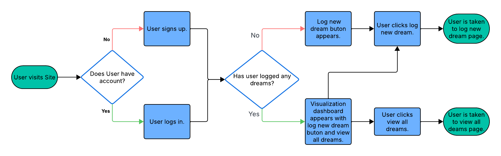
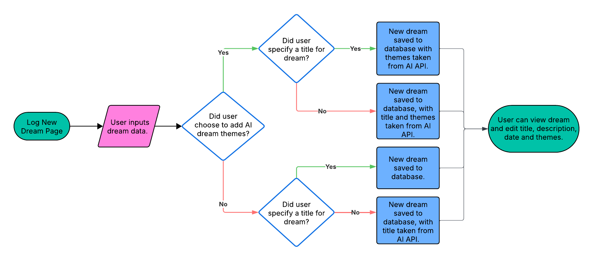
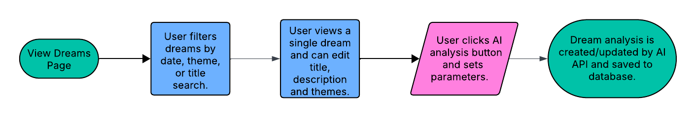
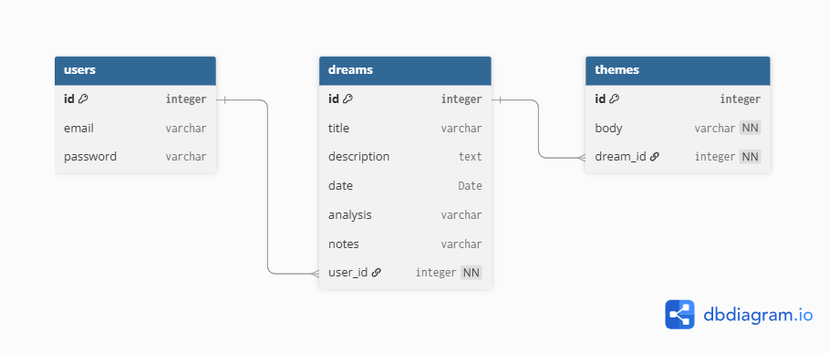
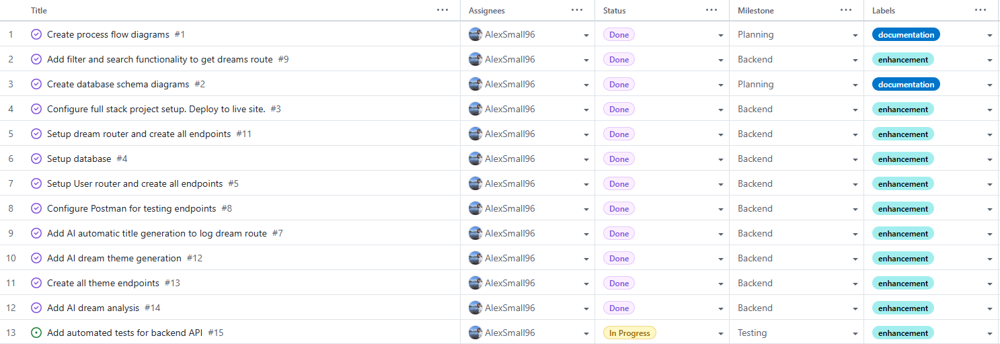
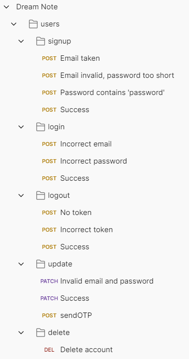
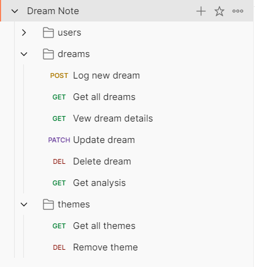

# Dream Note
Dream Note is an AI-assisted dream journal app. Users can:
- Record dreams, with automatic AI title and theme generation. 
- View dreams chronologically or by theme.
- Generate customizable, AI dream analysis. 
## Live Site
[https://dream-note-uh6p.onrender.com/](https://dream-note-uh6p.onrender.com/)

Credentials for demo account with sample data:

Email: demo-user@email.com

Password: demo1234

**Note:** Mock versions of AI-assisted features are currently being used to minimize costs while the project is in development.

## Repository
[https://github.com/AlexSmall96/Dream-Note](https://github.com/AlexSmall96/Dream-Note)
## Author
Alex Small | [GitHub](https://github.com/AlexSmall96) | [LinkedIn](https://www.linkedin.com/in/alex-small-a8977116b/)
## Table of Contents
- [Dream Note](#dream-note)
  * [Live Site](#live-site)
  * [Repository](#repository)
  * [Author](#author)
  * [Table of Contents](#table-of-contents)
  * [🧪 Testing](#-testing)
  * [🥅 Project Goals and Planning](#-project-goals-and-planning)
    + [➡️ Process Flow Diagrams](#%EF%B8%8F-process-flow-diagrams)
    + [🗃️ Database Schema](#%EF%B8%8F-database-schema)
  * [📑 Methodology](#-methodology)
    + [Sprint 1: 📖 Planning and Initial Documentation](#sprint-1--planning-and-initial-documentation)
    + [Sprint 2: 🔧 Backend API](#sprint-2--backend-api)
    + [Sprint 3: 🧪 Backend Testing](#sprint-3--backend-testing)
    + [Sprint 4: 💻 Frontend Functionality](#sprint-4--frontend-functionality)
    + [Sprint 5: 🎨 Frontend Styling](#sprint-5--frontend-styling)
    + [Sprint 6: 🧪 Frontend Testing](#sprint-6--frontend-testing)
    + [Sprint 7: 📖 Remaining Documentation](#sprint-7--remaining-documentation)
  * [👤UX](#ux)
    + [👥 User Stories](#-user-stories)
    + [🎯 Target Audience](#-target-audience)
    + [🖼️ Wireframes](#%EF%B8%8F-wireframes)
    + [🔤 Fonts](#-fonts)
    + [📷 Images](#-images)
  * [🖥️  Programming Languages, Frameworks, and Libraries used](#%EF%B8%8F--programming-languages-frameworks-and-libraries-used)
  * [Other technologies used](#other-technologies-used)
  * [🤝 Credits](#-credits)
    + [Courses](#courses)
    + [APIs](#apis)
    + [Code](#code)
## 🧪 Testing 
Testing is detailed fully in [TESTING.MD](TESTING.MD)
## 🥅 Project Goals and Planning

### ➡️ Process Flow Diagrams
To plan the end to end processes involved in the site, the following diagrams were created.

**Home Page**

**Log New Dream**

**View Dreams Page**

### 🗃️ Database Schema
The below diagram was used to model the database schema.
Descriptions of the database tables and fields are as follows:

- **Users:** Contains User's login data.
- **Dreams:** Dreams the user will record. Contains description, date, and optional title, notes, and AI analysis. Related to the User model via a many to one relationship.
- **Themes:** Themes related to dream, either chosen by the user or AI generated. Related to the Dream model via a many to one relationship.

## 📑 Methodology
The project followed an agile methodology, with 7 distinct sprints . Throughout, a kanban board was used to plan and track progress.

### Sprint 1: 📖 Planning and Initial Documentation 
This phase consisted of initial brainstorming, where the basics of the idea were beginning to be fleshed out. During this phase, the tech stack that would be most suitable for the project purpose and my goals was decided on. Documentation was useful, with some process flows being created to map out some of the more complex processes involved in the site, as well as a database diagram, which helped confirm details of the database schema.
### Sprint 2: 🔧 Backend API 
The API for this site was written in [Node.js](https://nodejs.org/en) using Typescript. The [Express](https://expressjs.com/) framework was used to create all the HTTP endpoints (users, dreams, themes). [MongoDB](https://www.mongodb.com/) was used for the database, along with the [mongoose.js](https://mongoosejs.com/) object modeling framework. While the API was being developed, [Postman](https://www.postman.com/) was used to test HTTP endpoints.

HTTP testing in postman

User endpoints               | Dream and Theme endpoints
:-------------------------:| :-------------------------: 
              |   | 

### Sprint 3: 🧪 Backend Testing 
The majority of the functionality of the backend API was tested using Vitest. The supertest package was used to mock incoming HTTP requests, with send one time passcode requests being mocked in mailslurp. The remaining features not covered by automated tests were tested manually. See [TESTING.MD](TESTING.MD) for details.
### Sprint 4: 💻 Frontend Functionality 
### Sprint 5: 🎨 Frontend Styling 
### Sprint 6: 🧪 Frontend Testing 
### Sprint 7: 📖 Remaining Documentation 

## 👤UX
### 👥 User Stories

### 🎯 Target Audience

### 🖼️ Wireframes

### 🔤 Fonts

### 📷 Images

## 🖥️  Programming Languages, Frameworks, and Libraries used

- TypeScript    
- Backend 
    - Node.js 
    - Express
- Frontend
    - React
    - Next.js
    - TailwindCSS

## Other technologies used

- Deployment
    - Render
- Development
    - VS code
    - Postman
    - GitHub
- Documentation
    - lucidchart
    - dbdiagram
    
## 🤝 Credits
### Courses
### APIs
- The [Open AI API](https://openai.com/api) was used to generate dream analysis in production. A mock version was used during development to minimize costs. 
### Code

Code was taken from/inspired by the below articles. Whenever the code is used, it is referenced as a comment.

- Next.js and Express mono-repo setup: https://codezup.com/expressing-your-node-js-app-with-express-typescript-and-next-js/

- Authentication middleware: https://www.xjavascript.com/blog/express-auth-middleware-typescript/

- Dream Interface: https://www.slingacademy.com/article/mongoose-define-schema-typescript/

- Validate and send to an email address https://medium.com/@elijahechekwu/sending-emails-in-node-express-js-with-nodemailer-gmail-part-1-67b7da4ae04b
