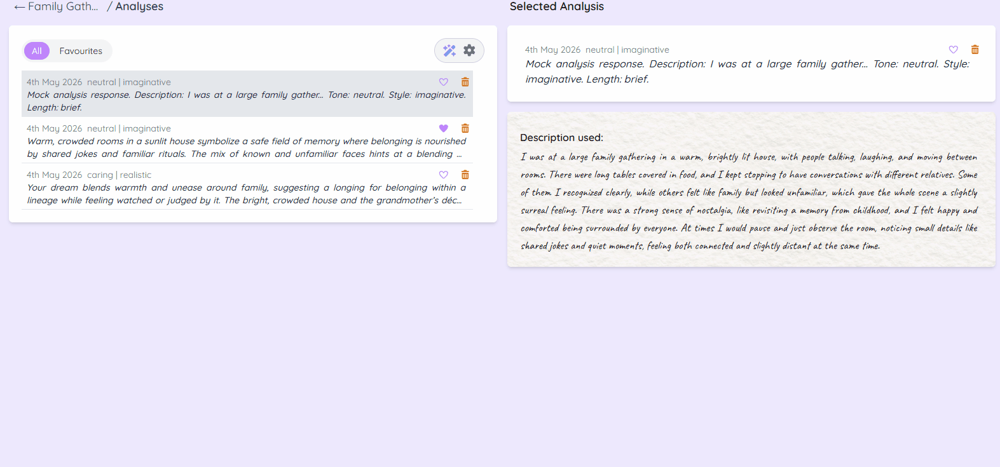
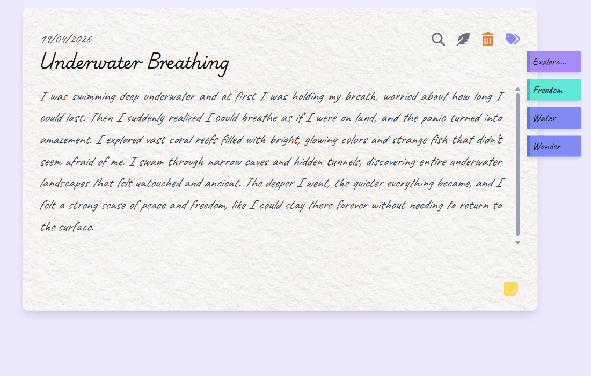
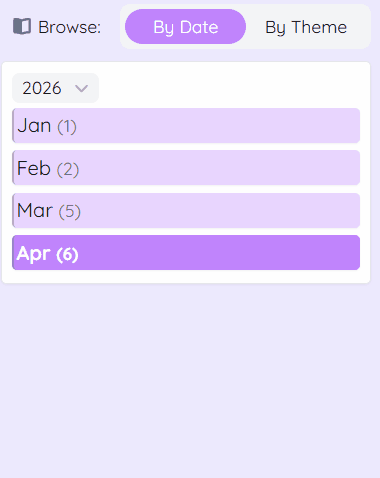
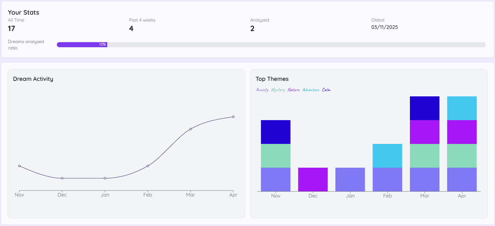
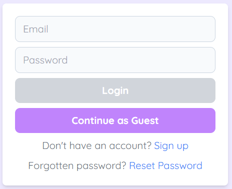
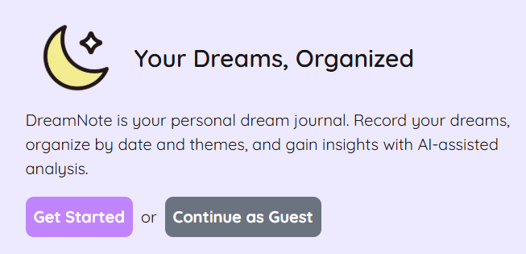

# DreamNote


Dream Note is an AI-assisted dream journal app where users can:
- Record dreams, with automatic AI title and theme generation.
- View dreams chronologically or by theme.
- Generate customizable, AI dream analysis.


### [🌐 Live Site](https://dream-note-uh6p.onrender.com/)


### [📖 Repository](https://github.com/AlexSmall96/Dream-Note)


## 🔍 Key Features


### AI-powered dream analysis



Generate and save AI dream analysis and automatically extract themes from dreams.


### Journal management



Create, edit, and manage personal dream journal entries.


### Categorize by Theme and Date



View dreams chronologically or based on theme.


### Dream pattern visualisation



Visualise dream patterns over time with interactive charts.

### Guest Access

| | |
|:---: | :---: |
| | | 

Login as a guest and explore a ready-to-go dream journal without sign-up, with restricted functionality to protect user data.

## 💻 Tech Stack
| Backend | Frontend | Database | Testing (Vitest) | Other Tools |
| :------:|:------: | :------: | :------: | :------: |
| Node.js   |   React      | MongodDB          | Supertest         |  GitHub       |  
|Express  |   Next.js      | Mongoose          | React Testing Library         | Postman        |  
|TypeScript  |  TailwindCSS       | MongoDB Compass         |  Mock Service Worker         |   dbdiagram      |  


## 🔧 Architecture
### Backend


The backend follows a layered architecture:


Client → Router → Controller → Service → Database


- **Routers** define API endpoints and handle request routing.  
- **Controllers** manage request/response handling and validation.  
- **Services** contain the core business logic and interact with the database.  


This separation keeps concerns isolated, making the codebase easier to maintain and refactor.  
Some services call other services where necessary to handle more complex workflows.


---


### Frontend


- **Pages** are kept thin, primarily handling routing, layout, and parameter management.  
- **Context** is used for global state management where needed.  
- **Protected and public layouts** manage authenticated vs unauthenticated states, with automatic redirection for restricted routes.  


This approach keeps UI logic simple while centralising state and access control.
## 🧪 Testing Strategy
### Backend
For the backend, I aimed for high test coverage (~90%+) using Vitest and supertest because a lot of the logic isn’t directly visible through the UI, and manual testing would miss edge cases. This was achieved using Vitest and Supertest for integration testing. As the project evolved and required refactoring, the test suite gave me confidence to make changes safely.


---

### Frontend
For the frontend, I prioritised manual testing of key user flows, since the behaviour is more visible and easier to validate interactively. I also included a small number of automated tests to demonstrate patterns such as component isolation, integration tests, and API mocking using React Testing Library and MSW.  Full frontend coverage wasn’t a priority for this project, so I focused on demonstrating understanding rather than completeness.


**Tools used:** Vitest, Supertest, React Testing Library, MSW


CI is configured using GitHub Actions to automatically run the test suite on pull requests before merging into the main branch, ensuring code quality and preventing regressions.


## 🔒 Security Considerations


- **Password Security**  
Passwords are securely hashed using bcrypt before storage.


- **Password Reset & OTP Handling**  
Password resets are handled via one-time passcodes (OTPs) sent to the user’s email.  
OTPs are stored as hashed values and associated with the requesting user, preventing exposure of sensitive data.


- **Protection Against Email Enumeration**  
Password reset requests return a generic response (“If this email is associated with an account…”) to avoid revealing whether an account exists.


- **Email Verification & Account Restrictions**  
Users must verify their email before performing sensitive actions such as deleting their account or updating their password.


- **Authentication Flow & Route Protection**  
Protected and public layouts are used to differentiate authenticated and unauthenticated states.  
Unauthenticated users attempting to access protected routes are redirected to the landing page.


- **Signup vs Login Trade-off**  
 Signup responses return specific validation errors (e.g. invalid email or password) to improve user experience, even though this can reveal account existence.  
This is a deliberate trade-off, which would be mitigated by typical protections such as rate limiting and CAPTCHA in a commercial setting.  
In contrast, login and password reset flows always return generic responses to minimise enumeration risk.

- **Guest Access**

    Guest access is implemented as a restricted authentication mode with limited permissions compared to full user accounts.

##  🤖 Use of AI During Development


Large language models and AI tools were used pragmatically throughout development to support productivity and problem-solving.


- Used for brainstorming initial features and exploring product direction.
- Acted as a sounding board for UI and UX decisions.
- Assisted with debugging and refining architectural approaches.
- Helped generate boilerplate code to speed up development.


GitHub Copilot was used for inline code suggestions during development, primarily to improve speed and reduce repetitive coding tasks. All generated code was reviewed and adapted as needed.
## 📈 Future Improvements


- Enhance the dashboard by allowing statistics to act as interactive filters, enabling users to quickly explore related dreams.


- Extend AI capabilities to identify recurring themes and patterns across multiple entries over time.


- Expand frontend test coverage around key user flows to improve confidence when scaling the application and making future changes.


## 💻 Setup
### Prerequisites
- Node.js (v18+)
- npm


### Installation
- git clone https://github.com/AlexSmall96/Dream-Note
- cd dream-note
- npm install
### Environment Variables
Create a `.env` file:
```
DATABASE_URL=your_database_url
DATABASE_NAME=your_database_name
PORT=3000
JWT_SECRET=your_jwt_secret
SMTP_MAIL=your_smtp_mail
SMTP_PASS=your_smtp_pass
SMTP_SERVICE=your_smtp_service
API_KEY=your_open_ai_api_key
NEXT_PUBLIC_API_URL=http://localhost:3000/api
GUEST_USER_EMAIL=demo-user@email.com
RESET_TOKEN_SECRET=your_reset_token_secret
```


### Running the Application
npm run dev:server
### Running Tests
- Frontend: npm run test:frontend
- Backend: npm run test:backend


## 👤Author
Alex Small | [GitHub](https://github.com/AlexSmall96) | [LinkedIn](https://www.linkedin.com/in/alex-small-a8977116b/)


## 🤝 Credits

### Courses
The following Udemy courses were used as learning material and reference for understanding core concepts and design patterns. Code was not directly copied; instead, concepts and approaches were adapted and implemented independently within the context of this project.

[TypeScript Masterclass 2025 Edition](https://www.udemy.com/share/107gI83@aepficRZ9jCocijvACROtXiybQsrFgGyZNRZbr3m_h3nM4GBSRmzjteQwqqHL77vNA==/), Manik (Cloudaffle)

[The Complete Node.js Developer Course](https://www.udemy.com/share/101WpA3@axxx9LdpyD80gBwaqPm-oFrqpKY6mTlnJqizWyyCDoAbWyuWP4EBquHKkLNo_pTyKg==/), Andrew Mead, Rob Percival

[React Testing Library with Jest/Vitest](https://www.udemy.com/share/104dVy3@v6zniGwak65W9VldWOTX2axb8jDQZbQh_ZgzQP6FilrN6WrWG6nZuu9fRHWAOScCxA==/), Bonnie Schulkin
### APIs
The [Open AI API](https://openai.com/api) was used for AI dream analysis, and automatic themes and title generation in production. A mock version was used during development to minimize costs.
### Code


Code was taken from/inspired by the below articles. Whenever the code is used, it is referenced as a comment.


- Next.js and Express mono-repo setup: https://codezup.com/expressing-your-node-js-app-with-express-typescript-and-next-js/


- Authentication middleware: https://www.xjavascript.com/blog/express-auth-middleware-typescript/


- Dream Interface: https://www.slingacademy.com/article/mongoose-define-schema-typescript/


- Validate and send to an email address https://medium.com/@elijahechekwu/sending-emails-in-node-express-js-with-nodemailer-gmail-part-1-67b7da4ae04b


