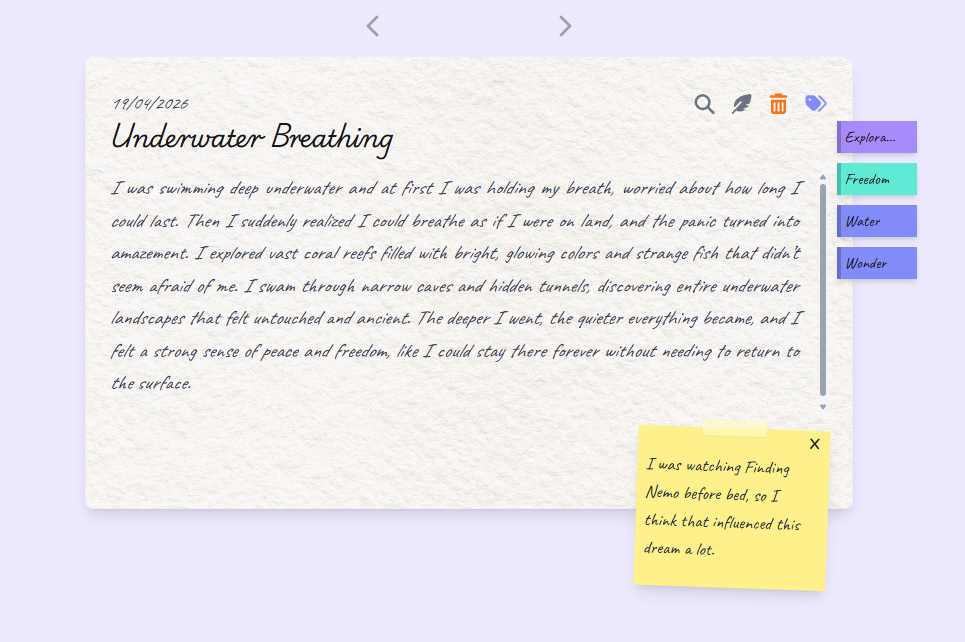
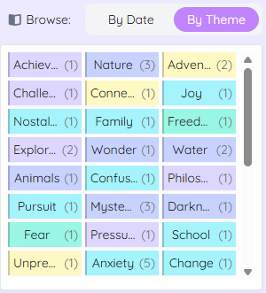
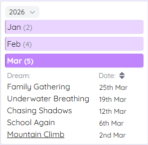
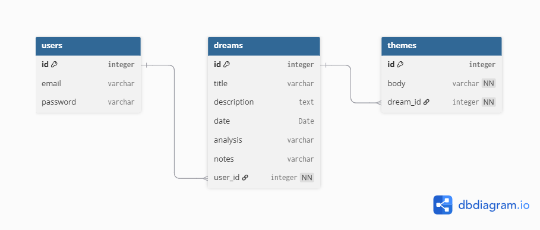

# DreamNote

Dream Note is an AI-assisted dream journal app where users can:
- Record dreams, with automatic AI title and theme generation. 
- View dreams chronologically or by theme.
- Generate customizable, AI dream analysis. 

### [🌐 Live Site](https://dream-note-uh6p.onrender.com/)

### [📖 Repository](https://github.com/AlexSmall96/Dream-Note)

## 🔍 Key Features

### AI-powered dream analysis

Generate and save AI dream analysis and automatically extract themes from dreams.

### Journal management

Create, edit, and manage personal dream journal entries.

### Categorize by Theme and Date
|   |  |
|:--:|:---:|
|  | 

View dreams chronologically or based on theme.

### Dream pattern visualisation

Visualise dream patterns over time with interactive charts.

## 💻 Tech Stack
| Backend | Frontend | Database | Testing (Vitest) | Other Tools |
| :------:|:------: | :------: | :------: | :------: |
| Node.js   |   React      | MongodDB          | Supertest         |  GitHub       |  
|Express  |   Next.js      | Mongoose          | React Testing Library         | Postman        |  
|TypeScript  |  TailwindCSS       | MongoDB Compass         |  Mock Service Worker         |   dbdiagram      |  

## 🔧 Architecture
### 🗃️ Database Schema
The below diagram was used to model the database schema.
Descriptions of the database tables and fields are as follows:

- **Users:** Contains User's login data.
- **Dreams:** Dreams the user will record. Contains description, date, and optional title, notes, and AI analysis. Related to the User model via a many to one relationship.
- **Themes:** Themes related to dream, either chosen by the user or AI generated. Related to the Dream model via a many to one relationship.

## 🧪 Testing Strategy
### Backend
For the backend, I aimed for high test coverage (~90%+) using Vitest and sueprtest because a lot of the logic isn’t directly visible through the UI, and manual testing would miss edge cases. This was achieved using Vitest and Supertest for integration testing. As the project evolved and required refactoring, the test suite gave me confidence to make changes safely.

### Frontend
For the frontend, I prioritised manual testing of key user flows, since the behaviour is more visible and easier to validate interactively. I also included a small number of automated tests to demonstrate patterns such as component isolation, integation tests and API mocking using React Testing Library and MSW.  Full frontend coverage wasn’t a priority for this project so I focused on demonstrating understanding rather than completeness. 

**Tools used:** Vitest, Supertest, React Testing Library, MSW

## 🔒 Security Considerations

## 	🤖 Use of AI During Development

## 📈 Future Improvements

## 💻 Setup

## 👤Author 
Alex Small | [GitHub](https://github.com/AlexSmall96) | [LinkedIn](https://www.linkedin.com/in/alex-small-a8977116b/)

## 🤝 Credits
### Courses
### APIs
- The [Open AI API](https://openai.com/api) was used to generate dream analysis in production. A mock version was used during development to minimize costs. 
### Code

Code was taken from/inspired by the below articles. Whenever the code is used, it is referenced as a comment.

- Next.js and Express mono-repo setup: https://codezup.com/expressing-your-node-js-app-with-express-typescript-and-next-js/

- Authentication middleware: https://www.xjavascript.com/blog/express-auth-middleware-typescript/

- Dream Interface: https://www.slingacademy.com/article/mongoose-define-schema-typescript/

- Validate and send to an email address https://medium.com/@elijahechekwu/sending-emails-in-node-express-js-with-nodemailer-gmail-part-1-67b7da4ae04b
