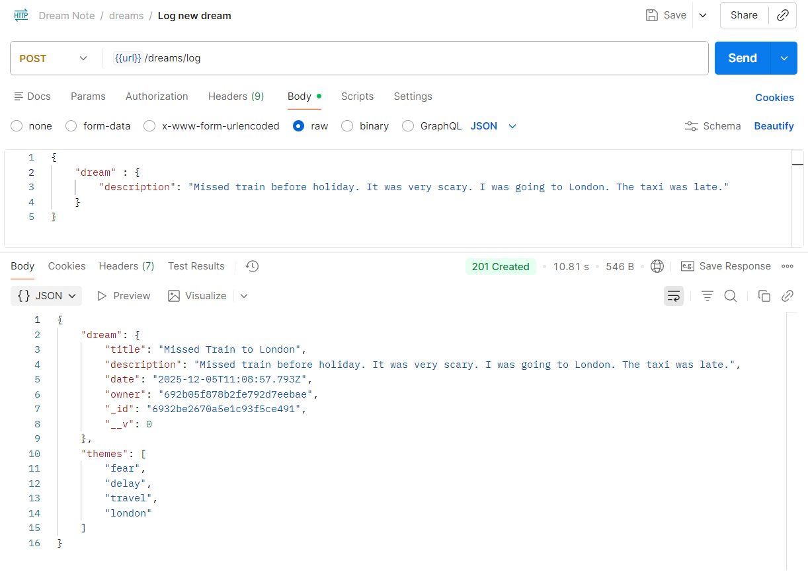
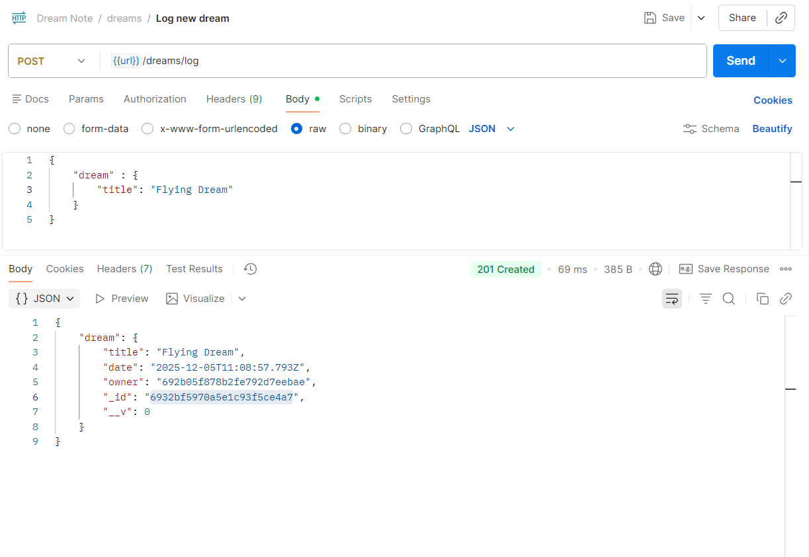
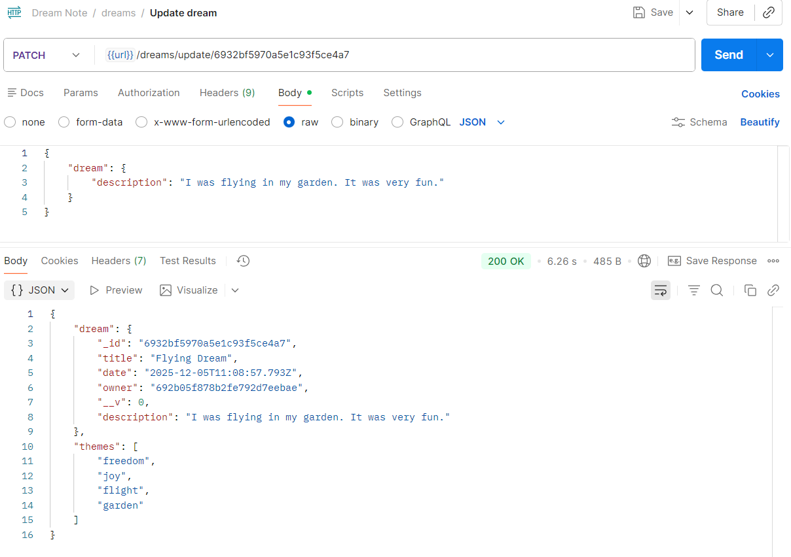
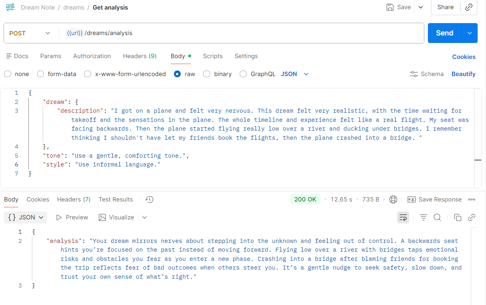
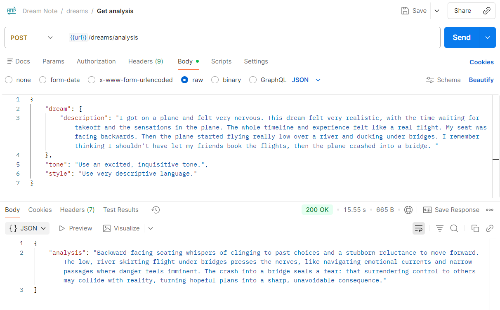
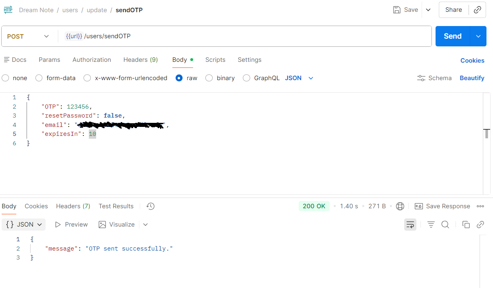
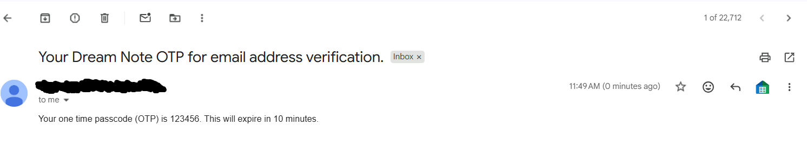
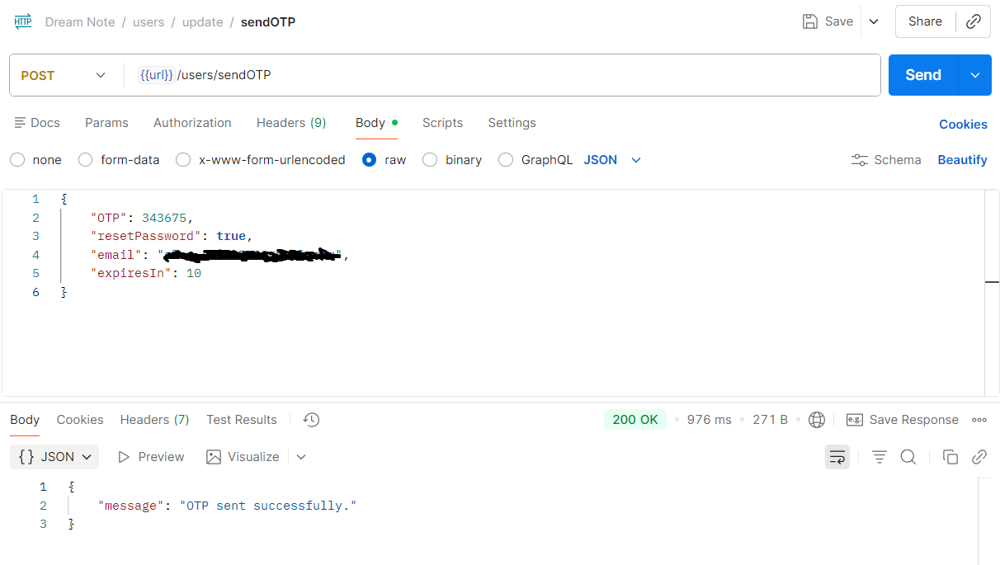
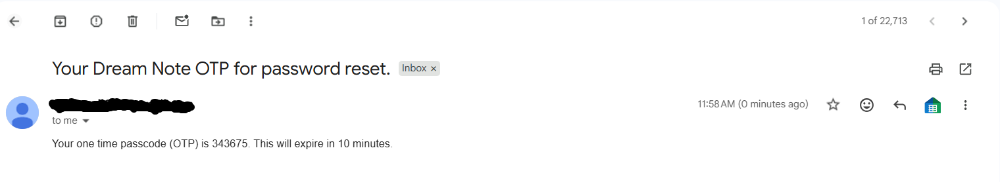

# Testing
This document covers all aspects of testing that were carried out to ensure the code was functional and executed as expected. The main method of testing was automated testing using vitest. Additional testing frameworks used were:
- Backend:
    - Supertest
    - Mailslurp

- Frontend:
    - React Testing Library
    - Mock Service Worker

Manual testing was used to test features not covered by automated testing. This document details my decision process with regards to which method to use.

## Backend
The below table summarizes the API endpoints and their automated test coverage, along with any aspects that need to be tested manually.

✔️ Fully covered

➖ Partially covered

Model | Request Type       |URL | Automated Test Coverage   |  Remaining Testing (if any)
:----:|:-------: | :-------------------:|:--------------------------:| :------------------------: 
Users |POST    |/signup              |  ✔️                        | -
Users |POST        |/login               |  ✔️                        | -
Users |POST       |/logout              |  ✔️                        | -
Users |POST       |/sendOTP            |  ➖                        | Verification of email delivery.              
Users |PATCH      |/update              |  ✔️                        | -
Users |DELETE          |/delete              |  ✔️                        | -
Dreams|POST          |/log                 |  ➖                        | Manual testing of real AI theme & title generation.
Dreams|POST          | /analysis            |  ➖                        | Manual testing of real AI dream analysis.
Dreams|GET          |/     |  ✔️                        | - 
Dreams|GET          |/view/:id     |  ✔️              | - 
Dreams|PATCH           |/update/:id        |  ➖                        | Manual testing of real AI theme & title generation.
Dreams|DELETE          |/delete/:id       |  ✔️                        | -
Themes|GET           |/            |✔️       | -
Themes|DELETE          |/delete/:id            |✔️ |-

### Automated Testing
Add screenshots of test results
### Manual Testing

#### OpenAI API Integration Testing
Two HTTP endpoints relied on data from the OpenAI API, '/api/dreams/analysis' and '/api/dreams/log'. Since this API incurred a charge, a DEV flag was used during development to generate a mock response, which was covered by automated tests in [dream.router.test.ts](server/routers/dream.router.test.ts). Due to time constraints and the complexity of the OpenAI API response structure, I decided to test the actual responses manually as opposed to mocking the responses using vitest. This was achieved by temporarily removing the DEV flag from my environment and generating real AI responses using [Postman](https://www.postman.com/).

**Manual testing of real AI theme & title generation.**

**Log New Dream**

The log new dream request was tested in Postman. The below images show the request body along with the actual response recieved from the OpenAI API.

*Criteria*:

✔️ Appropriate title based on description is generated by AI response.

✔️ Description posted by the user remains the same.

✔️ Appropriate Themes are added based on description

**Update Dream**

The update dream request was tested using the same method. The below images show the request body along with the actual response recieved from the OpenAI API. First, a dream is logged with no description, then its description is added in the update request.

Log dew dream without description         |           Update dream by adding description
:-------------------------:| :-------------------------:  |
 |    | 

*Criteria*:

✔️ No themes are added initially, 

✔️ Title posted by the user remains the same.

✔️ When description is added in update request, themes are added based on description.

✔️ Description and original title posted by the user remains the same.

✅ The log new and update dream routes meet all criteria.

**Manual testing of real AI dream analysis.**

The get analysis request was also tested in postman. Below are two responses based on the same dream description, with the tone and style parameters altered for each.

Response 1         |           Response 2
:-------------------------:| :-------------------------:  |
 |    |

*Criteria*:

✔️ Analysis is relevant to description.

✔️ Analysis provides meaningful insight.

✔️ Response conforms to tone and style requirements.

✅ The get analysis route meets all criteria.

**Verification of email delivery.**

A further test on the sendOTP route was carried out, to ensure the email can be sent to a real email address. This was also carried out in Postman. Two requests were made, one for email address verification and one for password reset. The request bodies and the recieved emails are shown below. 

Postman Request for Email Verification     |          Real Recieved Email
:-------------------------:| :-------------------------:  |
 |    |

Postman Request for Email Verification     |          Real Recieved Email
:-------------------------:| :-------------------------:  |
 |    |

*Criteria*:

✔️ Email arrives at correct address.

✔️ OTP and expiresIn values in email match request body.

✔️ The email subject ends with 'password reset' or 'email address verification' depending on the value of resetPassword in request body.

✅ The sendOTP route meets all criteria.